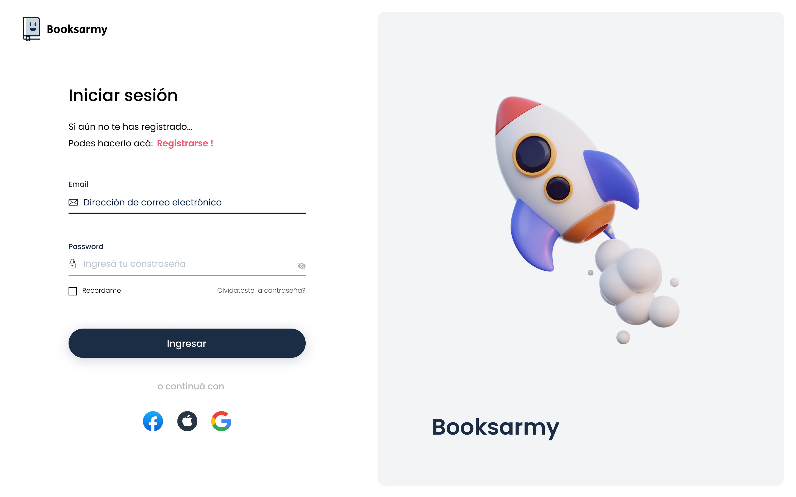
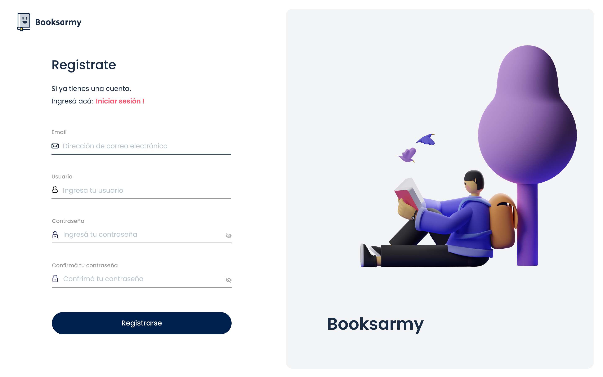

# ⭐ Grupo 4 - Booksarmy

> Proyecto integrador Digital House  

### Link al proyecto en figma:

 [Echá un vistazo a nuestros wireframes](https://www.figma.com/file/n1njq1fNKftSE4bcTy7Tue/Booksarmy?node-id=0%3A1) ✔️

### 🚀 ¿Qué productos o servicios brindará nuestro sitio?

Somos una empresa argentina de más de 20 años de trayectoria focalizada en la venta de libros. Nuestra misión es generar la satisfacción de nuestros clientes ofreciendo la más amplia variedad de literatura a través de la constante incorporación de libros de origen nacional e internacional.

### 🎯 ¿Quién será nuestra audiencia objetivo?

Estamos orientados al público joven y adulto mediante la venta retail con una gran cantidad de libros, venta online y telefónica a todo el país.

### 📌 Nuestro equipo está compuesto por 5 integrantes:

- **Erika Kowanz**:  
  Hola, yo soy Erika. Soy docente de secundaria. Estoy estudiando FullStack porque descubrí que me encanta el campo de las tecnologías.
- **Noemí Cantero**:  
  Mi nombre es Noemi. Soy Licenciada en Comunicaciones y trabajo en la industria de la hospitalidad, en el hotel Marriott Buenos Aires. Estudio FullStack porque me apasiona la programación.
- **Pablo Valles**:  
  Hola mi nombre es Pablo Valles, tengo 29 años y soy técnico analista y programador de sistemas, soy una persona muy activa, me encanta estar aprendiendo cosas nuevas y afrontar nuevos desafíos. Tengo una hija hermosa de 9 años y ella es mi motor para seguir adelante. 
  De éste curso espero poder adquirir los conocimientos necesarios para poder cambiar un poco el rumbo de mi profesión y poder dedicarme a lo que me gusta.
- **Ale Navarro**:  
  Hola mi nombre es Alejandro Navarro, tengo 32 años y soy estudiante de ingeniería en sistemas de información, actualmente me dedico a dar clases de apoyo en Matemática, Física y Química a alumnos de secundario, tamabién preparo a alumnos para los ingresos a carreras universitarias.
- **Fernando Videla**:  
  Hola, mi nombre es Fernando Videla. Soy profesor. Actualmente soy estudiante en programación FullStack. Mi campo es la educación pero mi pasión está la programación.

## 🌐 Páginas que nos inspiraron:

- 🌍 [libooks](https://libooks.com/)
- 🌍 [Sbs Librería](https://www.sbs.com.ar/)
- 🌍 [La casa del libro](https://www.casadellibro.com/)
- 🌍 [Planeta de libros](https://www.planetadelibros.com.ar/)
- 🌍 [Cupside](https://www.cuspide.com/)

## ✨ Wireframes

[Mirá nuestro prototipo:](https://www.figma.com/proto/n1njq1fNKftSE4bcTy7Tue/Booksarmy?node-id=7%3A2744&scaling=min-zoom&page-id=2%3A3&starting-point-node-id=7%3A2744&show-proto-sidebar=1) ✔️

  
  
  
  
  

 

     
 

