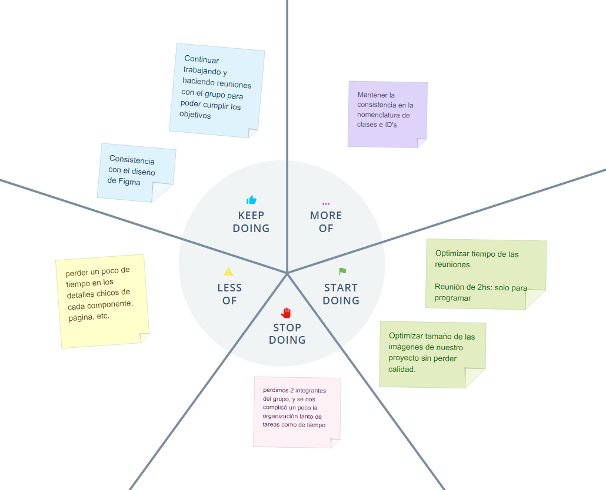

# 📝 Retro

Basamos nuestra retro sobre como fue nuestro trabajo, tanto desde lo grupal como lo individual.

## ✔️ Puntos

- ¿En qué nos trabamos y/o problemas que tuvimos que solucionar? - **Less of - Stop doing**

    **-** En este punto perdimos 2 integrantes del grupo, y se nos complicó un poco la organización tanto de tareas como de tiempo. *Sin embargo,* pudimos llevar a cabo los 2 sprints de forma correcta y a tiempo.

    **-** Nos demoramos un poco en los detalles finos, deberíamos hacerlo luego de terminar todas las páginas del proyecto

- ¿Qué hicimos bien? - **Keep doing - More of..**

    **-** Mantener la consistencia: Tanto a nivel diseño (con nuestro wireframe en figma), como en la nomenclatura de las partes, secciones y clases de nuestro proyecto.

- ¿En qué podríamos mejorar? - **Start doing**

    **-** Crear componentes: *botones, tables, cards, ect*; para poder reutilizarlos en toda nuestra página.  
    **-** Optimizar tamaño de las imágenes de nuestro proyecto sin perder calidad.  
    **-** Mejorar y optimizar el tiempo de nuestras reuniones; y que sean más específicas.

 

## 📷 Screenshot

- 🌍 [Nuestro Retro](https://app.moqups.com/XuC5glkAsD/view/page/af4f18784)

